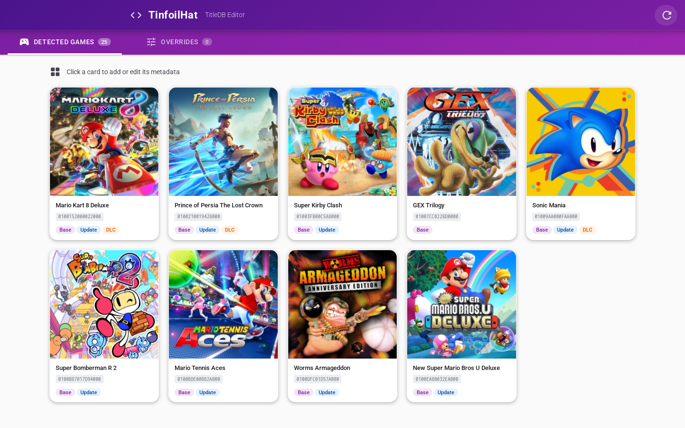
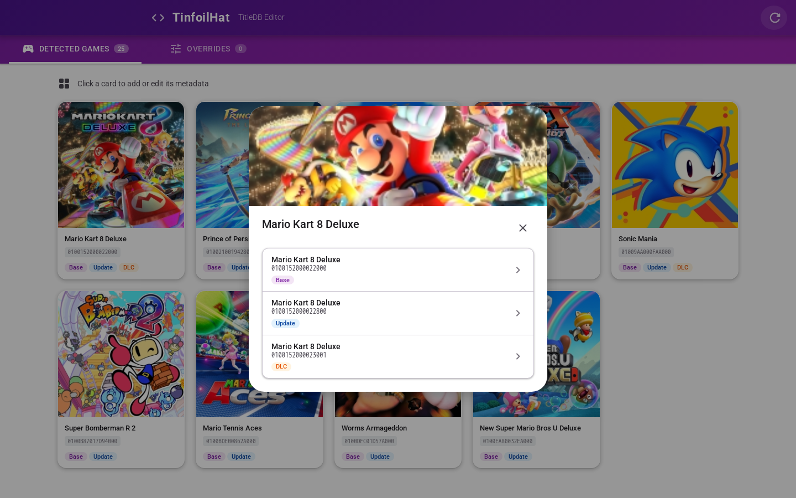
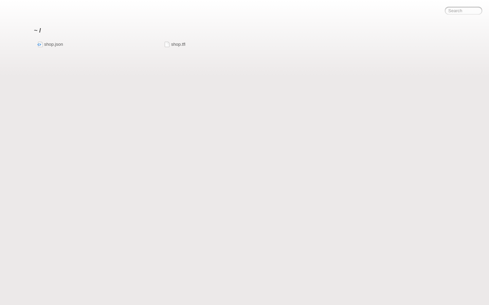

# 📂 Mobihen Eshop Server

> Developed and maintained by **Mobihen**. (Formally built upon the great original work by [vinicioslc/tinfoil-hat](https://github.com/vinicioslc/tinfoil-hat)).

[](https://github.com/mobihen/tinfoil-hat/actions/workflows/playwright.yml)

A powerful, entirely Docker-based Tinfoil Server designed to host and organize your massive Nintendo Switch local game libraries flawlessly. Serve all `.NSP` and `.XCI` files dynamically across your LAN with practically zero friction and absolutely no file count limits!

## ✨ Key Features

- **Brand New Web Admin Panel** available at `/admin`! Visually manage Title ID dataset overrides, seamlessly auto-grouping Base Games over DLCs/Updates. Auto-downloads and caches box artwork locally!
- **Instant Indexing:** No waiting for cron/refresh intervals. Drop new games into the folder and reload the app!
- **RAM Conscious:** Extremely lightweight Node/Express HTTP server requiring less than 60MB of RAM—bypassing typical heavy NUT solution requirements.
- **Save Backup FTP Support:** Native save directory aggregation (integrates with JKSV).
- **Authentication Built-in:** Block untrusted viewers from accessing `shop.json` via Docker environment variables.

---

## 🎨 Web Admin Panel

Access **`http://<your-ip>:<port>/admin`** to launch the proprietary **TitleDB GUI**.

<div align="center">
  
</div>

It visually scans your games directory, aggressively maps Base Titles across any related Updates and DLC files, and grabs background image caches from `tinfoil.media`. 

You can click on any unified game card to manually inspect sub-files and edit Title ID properties (Release Date, Regions, Publishers, etc) which are compiled instantly into the global `shop.json`!

<div align="center">
  
</div>

---

## 🚀 Setup & Local Docker-Compose

Deploy exactly what you need in seconds via `docker-compose`.

```yml
version: '3'
services:
  mobihen-eshop:
    container_name: mobihen-eshop
    image: mobihen/mobihen-eshop:latest
    ports:
      - 80:80 # Maps container port 80 to your host port 80
    environment:
      # - AUTH_USERS=admin:password,buddy:123
      - UNAUTHORIZED_MSG='Access Denied!'
      - WELCOME_MSG='Connected to Mobihen Eshop!'
      - NX_PORTS=5000 
      - COVERS_PATH=/games/covers 
    volumes:
      # Map your local switch storage exactly here:
      - /mnt/mobimedia2t/shop/games:/games/
```

### ⚙️ Available Environment Variables

| Variable | Description | Default |
| -------- | ----------- | ------- |
| `ROMS_DIR_FULLPATH` | Absolute path mapping your Games folder. | `./games/` |
| `SAVES_BACKUP_PATH` | Absolute path routing all JKSV/Tinfoil saves. | `<roms_path>/Saves/` |
| `COVERS_PATH` | Cache location for box art assets. | `<roms_path>/covers/` |
| `TITLEDB_PATH` | Absolute location for preserving manual metadata edits json. | `titledb.json` (ROOT) |
| `JSON_TEMPLATE_PATH`| Absolute location pointing to the `shop_template.jsonc` logic payload. | `shop_template.jsonc` (ROOT) |
| `TINFOIL_HAT_PORT` | Overrides the internal listening port. | `80` |
| `AUTH_USERS` | Comma-separated Tinfoil UserAuth tuples. Example: `admin:123,bob:456` | *None* |
| `UNAUTHORIZED_MSG` | Formatted response alerting unauthed logins natively. | `"No tricks and treats for you!!"` |
| `WELCOME_MSG` | General success message rendered on login inside tinfoil. | *None* |

<br />

<div align="center">
  <h3>Directory Fallback View</h3>
  
</div>

---
